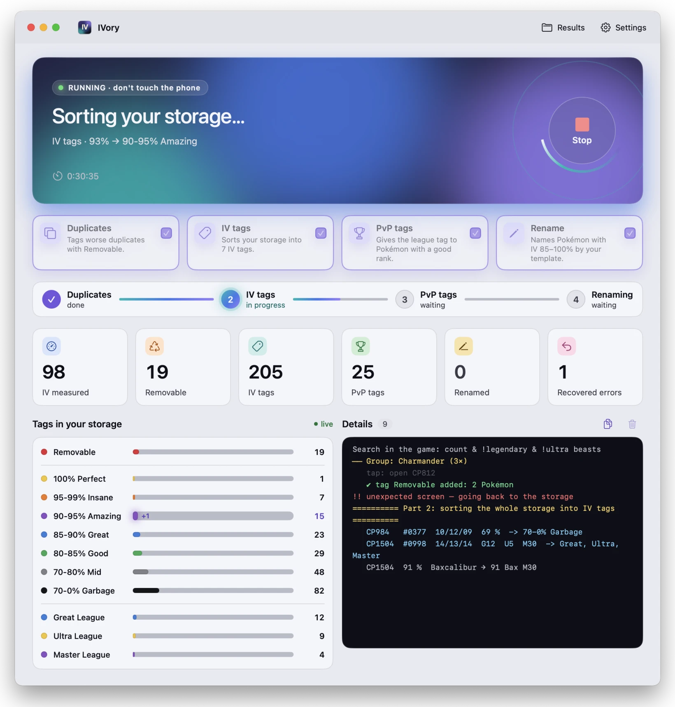
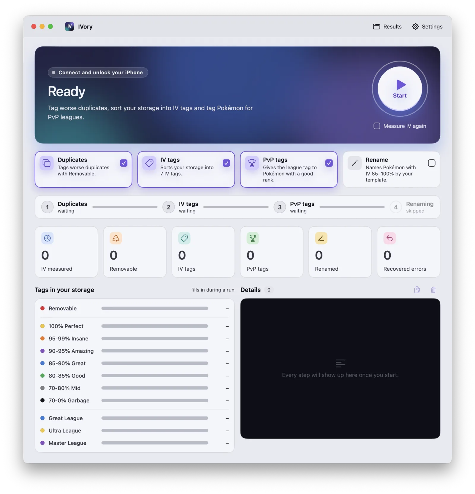
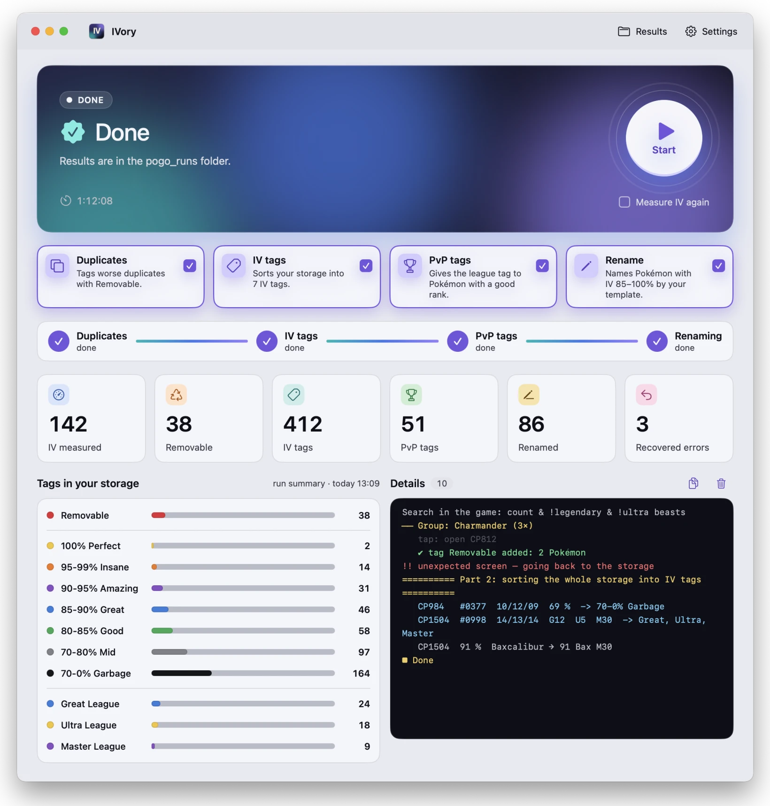
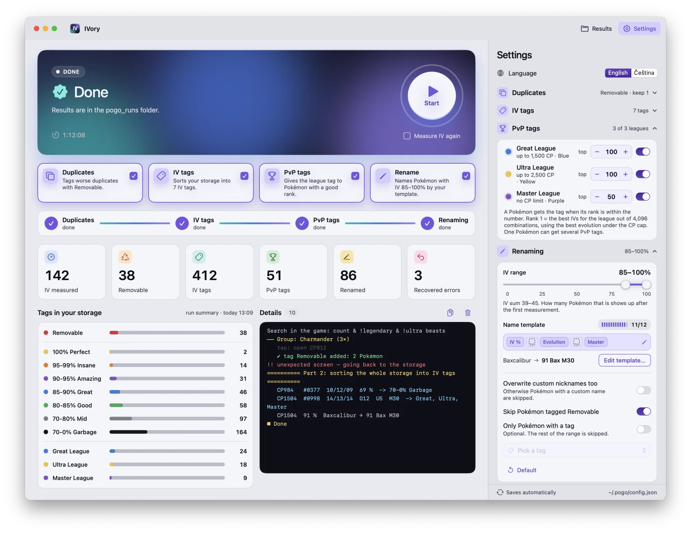
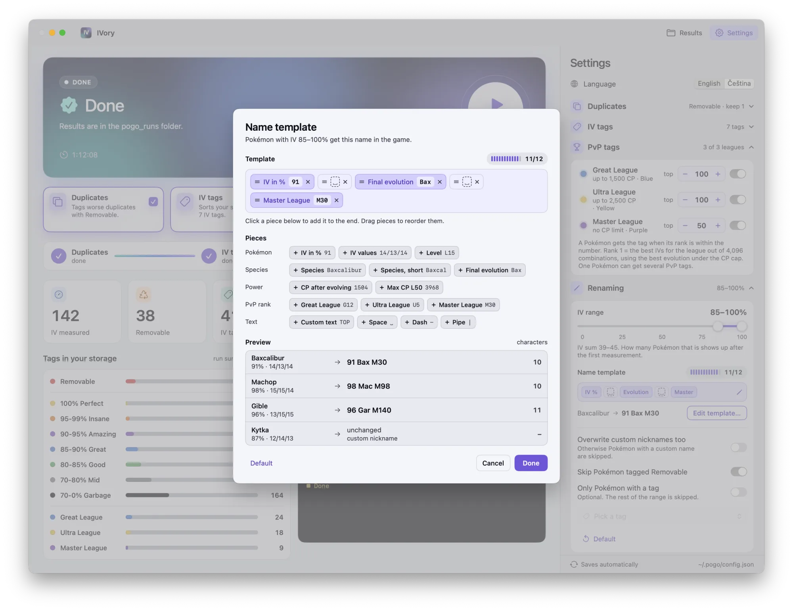
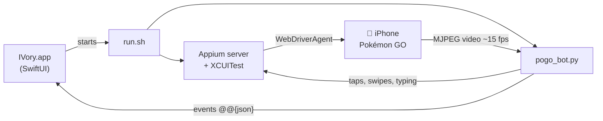

<p align="center">
  <picture>
    <source media="(prefers-color-scheme: dark)" srcset="docs/banner-dark.svg">
    <source media="(prefers-color-scheme: light)" srcset="docs/banner-light.svg">
    
  </picture>
</p>

<p align="center">
  <a href="https://github.com/ViktorKaderabek/IVory/releases/latest"></a>
  <a href="https://github.com/ViktorKaderabek/IVory/releases"></a>
  
  
  
  
  
  <a href="LICENSE.md"></a>
</p>

<p align="center">
  <b>Tidy up your Pokémon GO storage from your Mac.</b><br>
  IVory drives the game on a USB-connected iPhone. It tags worse duplicates for transfer, sorts the whole
  storage into IV tags, tags good PvP candidates and renames your best Pokémon. It never transfers anything by itself.
</p>

<p align="center">
  <a href="https://github.com/ViktorKaderabek/IVory/releases/latest/download/IVory.dmg"><b>⬇&nbsp; Download IVory for Mac</b></a>
  &nbsp;·&nbsp; <a href="#installation">Installation</a>
  &nbsp;·&nbsp; <a href="#risks-and-responsibility">Risks</a>
  &nbsp;·&nbsp; <a href="#what-it-does">Features</a>
  &nbsp;·&nbsp; <a href="#how-it-works">How it works</a>
  &nbsp;·&nbsp; <a href="#troubleshooting">Troubleshooting</a>
</p>

<p align="center">
  <picture>
    <source media="(prefers-color-scheme: dark)" srcset="docs/screenshots/running-dark.webp">
    <source media="(prefers-color-scheme: light)" srcset="docs/screenshots/running-light.webp">
    
  </picture>
</p>

## Risks and responsibility

> [!CAUTION]
> **Using IVory can get your Pokémon GO account banned.** Automating the game breaks the Pokémon GO Terms of Service. Niantic can suspend or permanently ban accounts that use automation.

By using IVory you confirm that:

- you understand your account can be suspended or permanently banned,
- you use IVory at your own risk and you alone are responsible for your account,
- the authors are not liable for any loss, including lost accounts, Pokémon or items.

IVory never transfers Pokémon. It only adds tags and nicknames, and it cancels every confirmation dialog. Mistakes are still possible, so check the tags before you transfer anything yourself.

The app asks you to confirm this on first launch.

<sub>IVory is not affiliated with, endorsed or sponsored by Niantic, Inc., The Pokémon Company or Nintendo. Pokémon and Pokémon GO are trademarks of their respective owners.</sub>

## What it does

IVory runs up to four steps. Combine them as you like; they always run in this order:

| Step | What happens |
|---|---|
| 🗂️ **Duplicates** | Types your search (default `count & !legendary & !ultra beasts`) into the storage, groups identical Pokémon by their picture, reads the IVs of each one from the appraisal and tags the worse ones **`Removable`**. The best one stays untouched. |
| 🏷️ **IV tags** | Goes through the whole storage and puts every Pokémon into an IV tag: `100% Perfect`, `95-99% Insane`, … `70-0% Garbage`. An IV tag that no longer fits is removed. |
| 🏆 **PvP tags** | Pokémon with a good IV rank for a league get `Great League`, `Ultra League` or `Master League` (rank limits 100 / 100 / 50 by default). |
| ✏️ **Rename** | Pokémon in an IV range (85–100 % by default) get a name built from your template, e.g. `91 Bax M30` = 91 % IV, final evolution Baxcalibur, rank 30 in Master League. Custom nicknames are left alone. |

Tags that are missing in the game are created at the start, in the color you picked (the game offers 8 colors).

> [!IMPORTANT]
> IVory **never transfers anything**. It only tags and renames. The transfer is up to you:
> search `#Removable` in the game → select all → Transfer.

## How fast is it

<p align="center">
  <picture>
    <source media="(prefers-color-scheme: dark)" srcset="docs/speed-dark.svg">
    <source media="(prefers-color-scheme: light)" srcset="docs/speed-light.svg">
    
  </picture>
</p>

<p align="center">
  <picture>
    <source media="(prefers-color-scheme: dark)" srcset="docs/vs-hand-dark.svg">
    <source media="(prefers-color-scheme: light)" srcset="docs/vs-hand-light.svg">
    
  </picture>
</p>

Renaming takes most of the time because the game needs a few taps and the keyboard for every name.
Without renaming, a storage of 425 Pokémon is done in about 20 minutes. Repeated runs are faster still:
measured IVs are remembered for a few hours.

## Screenshots

<p align="center">
  <picture>
    <source media="(prefers-color-scheme: dark)" srcset="docs/screenshots/ready-dark.webp">
    
  </picture><br>
  <sub><b>Ready.</b> Tick the steps and press <i>Start</i> (or Enter).</sub>
</p>

<p align="center">
  <picture>
    <source media="(prefers-color-scheme: dark)" srcset="docs/screenshots/done-dark.webp">
    
  </picture><br>
  <sub><b>Done.</b> The tiles and the <i>Tags in your storage</i> panel stay as a summary of the run.</sub>
</p>

<table>
  <tr>
    <td width="40%" valign="top">
      <picture>
        <source media="(prefers-color-scheme: dark)" srcset="docs/screenshots/settings-dark.webp">
        
      </picture><br>
      <sub><b>Settings.</b> Language and updates on top, PvP leagues with rank limits and tag colors, the IV range for renaming and the name template.</sub>
    </td>
    <td width="60%" valign="top">
      <picture>
        <source media="(prefers-color-scheme: dark)" srcset="docs/screenshots/editor-dark.webp">
        
      </picture><br>
      <sub><b>Name template.</b> Build names from pieces; the preview shows what fits into the game's 12 characters.</sub>
    </td>
  </tr>
</table>

Light and dark appearance follow macOS. The app is in English or Czech: it follows your system language and you can switch it any time in Settings, even while sorting.

## Requirements

| | |
|---|---|
| 💻 **Mac** | macOS 14 Sonoma or later, Apple Silicon or Intel |
| 🛠️ **Xcode** | Free from the [App Store](https://apps.apple.com/app/xcode/id497799835). Open it once after installing. Sign in with your Apple ID under Xcode → Settings → Accounts. |
| 📱 **iPhone** | Connected by cable, unlocked and trusted, with **Developer Mode** on and **UI Automation** enabled (see [iPhone setup](#iphone-setup-one-time)) |
| 🌐 **Internet** | Only for the first start, which downloads about 250 MB of tools |

Everything else (Node.js, Appium with the XCUITest driver, Python with OpenCV and Apple Vision) **is downloaded by IVory itself** on the first start. You don't need Homebrew or Terminal.

## Installation

### Download (recommended)

1. Download **[IVory.dmg](https://github.com/ViktorKaderabek/IVory/releases/latest/download/IVory.dmg)** from the [latest release](https://github.com/ViktorKaderabek/IVory/releases/latest).
2. Open it and drag **IVory** into **Applications**.
3. Open IVory from Applications.
   IVory isn't notarized by Apple, so the first time macOS says it can't verify the app.
   Click **Done**, then go to **System Settings → Privacy & Security**, scroll down and click **Open Anyway** next to IVory.
   You only need to do this once.

   <details>
   <summary>Or from Terminal</summary>

   ```bash
   xattr -dr com.apple.quarantine /Applications/IVory.app
   ```

   </details>
4. Read the risk notice and confirm all three points (only the first time).
5. Connect your iPhone and press **Start**.
   The first start sets everything up by itself and shows each step in the app:

   | | What IVory installs | Where |
   |---|---|---|
   | 1 | Node.js 24 (official build from nodejs.org), only if you don't have Node 20+ already | `~/.pogo/runtime/node` |
   | 2 | Appium 3 and its XCUITest driver (includes WebDriverAgent) | `~/.pogo/runtime/node`, `~/.appium` |
   | 3 | Python 3.12 ([python-build-standalone](https://github.com/astral-sh/python-build-standalone)) | `~/.pogo/runtime/python` |
   | 4 | Python libraries: Appium client, OpenCV, NumPy, Pillow, PyObjC (Apple Vision) | `~/.pogo/venv` |

   Node.js and Python are pinned to exact versions and checked against SHA-256 checksums, Appium and the XCUITest driver are pinned to exact versions, and the Python libraries come from PyPI (`core/requirements.txt`). It takes a few minutes, needs no password and is skipped on later starts.
   On the first run Xcode also builds and signs WebDriverAgent on your iPhone, which takes another minute or two.

### Updates

IVory checks for a new version when it starts and then once a day. When there is one, a banner shows up above the main card:

1. **What's new** opens the release notes, **Download** fetches the new version in the background. You can keep working.
2. The download is checked against the SHA-256 checksum published with the release.
3. **Restart** swaps the app for the new one and opens it again. Your settings and measured IVs stay.

IVory never updates by itself and you can't restart while it's sorting: the banner waits until the run ends.
The × hides the banner until the next start. You can also check by hand or turn the automatic check off in **Settings → Updates**.

### Build from source

```bash
git clone https://github.com/ViktorKaderabek/IVory.git
cd IVory
bash app/build_app.sh --install     # → ~/Applications/IVory.app
```

Without `--install` the app stays in `dist/`. To build the installer DMG yourself:

```bash
bash scripts/build_dmg.sh           # → dist/IVory.dmg
```

## iPhone setup (one time)

1. Connect the iPhone by cable, unlock it and confirm **Trust This Computer**.
2. Turn on **Developer Mode**: Settings → Privacy & Security → Developer Mode (the iPhone restarts).
   If you don't see it, open Xcode once with the iPhone connected.
3. Turn on **Settings → Developer → Enable UI Automation**.
4. In IVory open **Settings → iPhone** and press **Find** and **Detect**. This fills in the device and the Apple Team ID
   used to sign WebDriverAgent. With a free Apple ID the signature is valid for 7 days. After that, IVory signs it again on the next start.
5. The first time WebDriverAgent starts, the iPhone may ask you to trust the developer:
   Settings → General → VPN & Device Management → your Apple ID → Trust.

## Usage

### The app

1. Tick the steps: **Duplicates**, **IV tags**, **PvP tags**, **Rename**. At least one step has to stay on.
2. Open Pokémon GO on the iPhone and press **Start** (or hit Enter). Don't touch the phone while IVory is running.
   The hero card shows what is happening right now. Below it you see the progress of the steps and the tiles:
   IVs measured, `Removable`, IV tags, PvP tags, renamed, recovered errors.
   The **Tags in your storage** panel shows how many Pokémon are in each tag. Next to it is a detailed log you can select and copy.
3. **Stop** ends the run cleanly and saves the results. **Results** in the toolbar opens the results folder.

**Settings** slide in from the right. The sections can be collapsed:

- **Duplicates**: the search typed into the game, the tag for worse duplicates and its color, how many of the best to keep.
- **IV tags**: thresholds in percent, name and color of every tag (click the dot to pick a color).
- **PvP tags**: per league: on/off, rank limit and tag color.
- **Renaming**: IV range (dual slider), name template (editor with pieces and preview), overwrite custom nicknames, skip `Removable`, only Pokémon with a given tag.
- **Language and updates** (the card on top): Čeština / English, the installed version, **Check now** and **Check automatically**, and how much space the run results in `~/Desktop/pogo_runs` take, with **Delete** (the bot's memory stays).
- **iPhone** (device, Apple Team ID) and **Advanced**.
- **About**: version, license, the risk notice, when you confirmed it and **Revoke consent** (the notice shows up again on the next start).

Everything is saved automatically to `~/.pogo/config.json`.

### Terminal

```bash
bash scripts/run.sh                                   # duplicates + IV tags
bash scripts/run.sh --steps duplicates,iv,pvp,rename  # any combination of steps
bash scripts/run.sh --steps iv,pvp                    # only IV and PvP tags
bash scripts/run.sh --fresh                           # measure IVs again (ignore the cache)
```

Or double-click `Start.command`. The script sets up the same tools as the app on its first run.
If you haven't confirmed the risk notice in the app yet, the script shows it and asks you to type `I agree`.

## How it works



- The iPhone is controlled through **Appium + WebDriverAgent** (XCUITest), the same tooling used for automated iOS app tests.
- The screen arrives as a video stream (~15 fps) and text is read with **Apple Vision** OCR right on the Mac.
- IVs are read pixel by pixel from the appraisal bars.
- **Fast mode** (default) reads the storage only once, for all steps. In the appraisal it jumps to the next Pokémon with the ▶ arrow and keeps everything in memory; duplicates, IV tags, PvP tags and renaming are all decided from that one read.
- **Batch tagging through search:** for each tag IVory types the CPs of the Pokémon that need it into the storage search (`cp2260,cp2268,cp1705`). The game then shows just those Pokémon on a screen or two, so IVory selects them all and tags them at once instead of scrolling through the whole storage. Renaming uses the same trick.
- Species, level, CP after evolution and PvP ranks are computed from CP, HP and IVs using game data shipped in `core/pokedata.json` (PvPoke game master and CP multipliers). Nothing is downloaded while running.
- The bot recognizes about 15 game screens, so it finds its way back to the storage from anywhere and recovers from popups, game crashes and dropped connections.
- **Safety net:** before every tap it checks that `TRANSFER`, `EVOLVE`, `POWER UP` or `YES` is not nearby, and it always cancels confirmation dialogs (`CANCEL` / `NO`).

<details>
<summary><b>How IV %, PvP rank and the name pieces are calculated</b></summary>

- **IV %** = (attack + defense + HP) / 45, rounded. The range 85–100 % therefore starts at an IV sum of 39.
- **PvP rank** = position of the Pokémon's IV combination among all 4,096 for the league (1 = best), at the highest level that stays under the CP cap (1,500 Great, 2,500 Ultra, none for Master), for its final evolution (with branching evolutions, the best branch).
- **Name pieces:** IV % (`91`), IV values (`14/13/14`), level (`L15`), species (`Baxcalibur`), short species (first 6 letters), final evolution (first 3 letters, `Bax`), CP after evolution, max CP at level 50, league ranks (`G12`, `U5`, `M30`), custom text, and separators (space, `-`, `|`). Names longer than 12 characters are cut.
- **Custom nickname** = a name that is neither the species name nor a name IVory gave earlier. Such Pokémon are skipped unless you turn on *Overwrite custom nicknames too*.
- **Refused names:** the game's word filter sometimes refuses a name, even one shaped like the others ("This name contains inappropriate text"). IVory then cancels the dialog, leaves the old name, tells you to rename that Pokémon yourself and doesn't try that name again.

</details>

## Configuration

`~/.pogo/config.json`: the app writes it, the bot reads it.

| Key | Default | Meaning |
|---|---|---|
| `language` | system | language of the app and the log: `en` or `cs` |
| `check_updates` | `true` | check for a new version on start and once a day |
| `udid` | empty | iPhone UDID; empty = the first connected device |
| `team_id` | empty | Apple Team ID for signing WebDriverAgent; empty = taken from the “Apple Development” certificate |
| `search_query` | `count & !legendary & !ultra beasts` | what the bot types into the storage search |
| `remove_tag` | `Removable` | tag for worse duplicates |
| `remove_tag_color` | `red` | color used when the tag is created: `blue`, `green`, `purple`, `yellow`, `red`, `orange`, `gray`, `black` |
| `keep_best` | `1` | how many of the best Pokémon to keep in each group of identical ones |
| `iv_tags` | 7 tags | `[{"min": 95, "name": "95-99% Insane", "color": "orange"}, …]`: a Pokémon gets the first tag whose threshold it reaches |
| `recheck_tagged` | `false` | slow mode only: `false` = skip Pokémon that already have an IV tag |
| `iv_cache_hours` | `6` | how long measured IVs stay valid (faster repeated runs) |
| `max_groups` | `0` | how many duplicate groups to process (0 = all) |
| `steps` | duplicates + IV | `{"duplicates": true, "iv": true, "pvp": false, "rename": false}` |
| `pvp` | 3 leagues | `{"great": {"name": "Great League", "enabled": true, "max_rank": 100, "color": "blue"}, "ultra": …, "master": …}` |
| `rename` | 85–100 % | `min`, `max`, `template` (pieces such as `{"k": "iv"}`, `{"k": "space"}`, `{"k": "text", "v": "TOP"}`), `overwrite_custom`, `skip_removable`, `only_tag` |
| `fast_mode` | `true` | `false` = the old slow mode that opens every Pokémon separately |
| `consent_version`, `consent_at`, `app_version` | – | written when you confirm the risk notice (in the app or in Terminal). Revoke it in Settings → About. |

## Files

| Path | Contents |
|---|---|
| `~/.pogo/config.json` | settings from the app |
| `~/.pogo/pamet.json` | measured IVs (kept for a few hours) and which Pokémon already got `Removable`. **Don't delete it** while tagged Pokémon are still in your storage: the bot uses it to avoid selecting them again, because a tap would untick the tag. |
| `~/.pogo/last_box.json` | the storage from the last measurement (species, IVs, league ranks). The app uses it for the number of Pokémon in the rename range and for the name previews. |
| `~/.pogo/runtime` | Node.js, Appium and Python downloaded on the first start |
| `~/.pogo/venv` | Python environment with the bot's libraries |
| `~/Library/Caches/IVory` | a downloaded update until it's installed |
| `~/Desktop/pogo_runs/<date_time>/` | results of a run: `log.txt`, `result.json`, `result_iv_tagy.json`, `iv/` (crops of the IV bars) and `chyba_XX/` (screens from the moment something went wrong) |

## Project layout

```
app/                 Mac app (SwiftUI), build script, icon
app/dmg/             background and window layout of the installer DMG
core/pogo_bot.py     the bot's entry point
core/ivory/          the bot, split into modules (settings and the game's UI strings in config.py)
core/pokecalc.py     CP and PvP math, with the game data in core/pokedata.json
scripts/run.sh       sets up the tools on the first start, starts Appium and the bot
scripts/build_dmg.sh builds dist/IVory.dmg
scripts/build_pokedata.py   refreshes the game data after new Pokémon are released
scripts/build_runtime.sh    builds a self-contained Node/Appium/Python runtime into build/
tests/               phone simulators and tests (see tests/README.md)
docs/                images for this README
Start.command        double-click launcher without the app
```

## Releasing a new version

1. Raise `CFBundleShortVersionString` (and `CFBundleVersion`) in `app/Info.plist`, e.g. `1.2.0`.
2. Build the installer: `bash scripts/build_dmg.sh` → `dist/IVory.dmg`.
3. Publish it as the latest release with the tag `v` + the same version. The file has to be named `IVory.dmg`:

   ```bash
   gh release create v1.2.0 dist/IVory.dmg --title "IVory 1.2.0" --notes-file notes.md
   ```

Apps from 1.1.0 on find the release by themselves and offer the update.

## Tests

The bot can be tested without a phone. `tests/sim_synthetic.py` draws all game screens itself and runs 26 scenarios: fast and slow mode, PvP tags, renaming, tagging through CP search, game crashes, a list that scrolls further than the finger like on a real iPhone, duplicated list cells and more.

```bash
cd tests
~/.pogo/venv/bin/python sim_synthetic.py            # all scenarios
~/.pogo/venv/bin/python sim_synthetic.py verbose    # one scenario with the bot's log
```

## Troubleshooting

- **“IVory can't be opened” / “Apple could not verify…”:** System Settings → Privacy & Security → **Open Anyway** (see [Installation](#download-recommended)).
- **“Xcode is missing” / “Xcode isn't set up yet”:** install Xcode from the App Store, open it once and let it install its components, then press Start again.
- **The first start fails while downloading:** check the internet connection and press Start again. Finished parts are kept, so it continues where it stopped.
- **“No iPhone found”:** unlock the phone, connect it by cable and confirm *Trust*. Turn on Developer Mode.
- **“Not authorized for performing UI testing actions”:** on the iPhone, turn on Settings → Developer → *Enable UI Automation*. IVory restarts WebDriverAgent once by itself before giving up.
- **WebDriverAgent can't be signed:** check the Team ID in Settings → iPhone and that your Apple ID is signed in to Xcode. A free signature lasts 7 days; Appium signs it again on the next start.
- **The bot gets stuck or taps the wrong spot:** the `chyba_XX` folder of the last run has screenshots of the last steps with the tap marked.
- **Game in another language:** the game's UI strings live in the `L` dictionary in `core/ivory/config.py`.

## Uninstall

Drag IVory from Applications to the Trash, then remove what it installed:

```bash
rm -rf ~/.pogo ~/.appium
```

Results of your runs stay in `~/Desktop/pogo_runs` until you delete them (**Settings → Run results → Delete** does it before you uninstall).
If you already used Appium before IVory, keep `~/.appium`.

## License

IVory is free for **noncommercial use** under the [PolyForm Noncommercial License 1.0.0](LICENSE.md). © 2026 Viktor Kadeřábek.

- ✅ You can use it for yourself, study the code, change it and share it, as long as you keep the license and the copyright notice.
- ❌ You can't sell it, offer it as a paid service or use it in a commercial product.

Want to use IVory commercially? [Open an issue](https://github.com/ViktorKaderabek/IVory/issues) and ask.

Contributions are welcome. By opening a pull request you agree that your contribution is released under the same license
and that the author may also license it under other terms.
